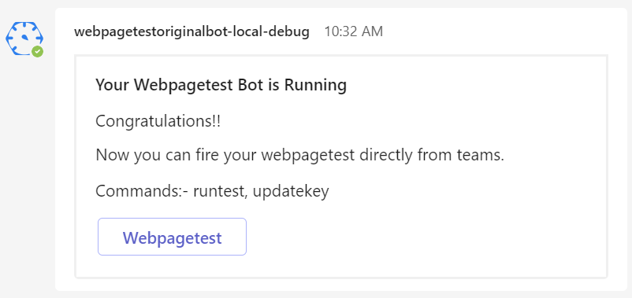
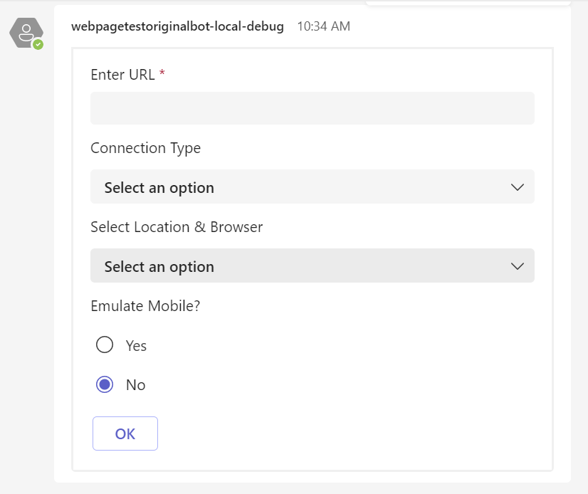
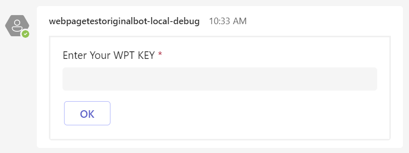
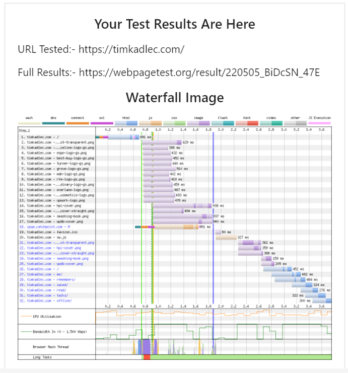

# TEAMS BOT - WEBPAGETEST

The WebPageTest Teams bot lets you run tests against WebPageTest from within Teams. Once the tests are complete, a copy of the waterfall and a link to the full results will be posted in your Bot channel.
How cool is that?

**Features:**
- Run WebPageTest from within Teams, and get the results posted back automatically.
- Full access to WebPageTest's 30+ test locations.

## Prerequisites

- [NodeJS](https://nodejs.org/en/)
- An M365 account. If you do not have M365 account, apply one from [M365 developer program](https://developer.microsoft.com/en-us/microsoft-365/dev-program)
- [Teams Toolkit Visual Studio Code Extension](https://aka.ms/teams-toolkit) version after 1.55 or [TeamsFx CLI](https://aka.ms/teamsfx-cli)

## Setup your teams bot

1. Clone this repo `git clone https://github.com/WebPageTest/webpagetest-teams-bot.git`

2. Open VScode and search for Teams toolkit and click install

3. Go to teamsFX icon on the left sidebar > Click open project & locate webpagetest-teams-bot

4. Now that the setup is complete, all you have to do is fire up the bot. To do so, press `f5` or manually run debug by selecting `Debug (Edge)`.
 

5. Teams will now install required dependencies (It will take a minute or two). And within this process it will ask for ngrox setup & ssl config, Click allow & install in all the popups. Teams will also ask to login into M365 if you don't have one use [this link](https://developer.microsoft.com/en-us/microsoft-365/dev-program) to register.

6. Then a seprate debug edge window will open with teams online, Login then a popup to add the bot will appear click on `Add`.

Now, All you have to do is fire up some tests.

## Supported Commands

1. welcome

2. runtest

3. updatekey

## Sample Output

